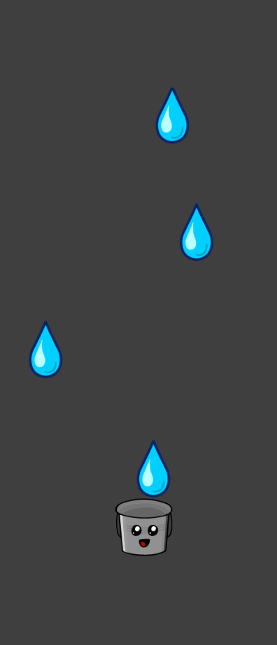

<!-- Usei este modelo como base de edição: https://github.com/othneildrew/Best-README-Template -->
<a id="readme-top"></a>

<!-- PROJECT LOGO -->
<br />
<div align="center">
  
  
  <h2 align="center">Rainy - Simple Game Project</h2>

  <p align="center">
    Rewriting <a href="https://libgdx.com/wiki/start/a-simple-game" target="_BLANK">Simple Game</a> from LibGDX into Kotlin for Android
    <br/>
  </p>
</div>
<!-- END: PROJECT LOGO -->

<!-- Tabela de resumo -->
<details>
  <summary>Summary</summary>
  <ol>
    <!-- Primeiro: About -->
    <li>
      <a href="#about-the-project">About the Project</a>
      <ul>
        <li><a href="#built-with">Built With</a></li>
      </ul>
    </li>
    <!-- Segundo: Descrição (com sublista) -->
    <li>
      <a href="#getting-started">Getting Started</a>
      <ul>
        <li><a href="#prerequisites">Prerequisites</a></li>
      </ul>
      <ul>
        <li><a href="#installation">Installation</a></li>
      </ul>
    </li>
    <!-- Quarto: Como executar o projeto -->
    <li>
      <a href="#screenshots">Screenshots</a>
    </li>
    <!-- Sétimo: Futuras Melhorias -->
    <li>
      <a href="#future-plans">Future Plans</a>
    </li>
    <!-- Oitavo: Licença -->
    <li>
      <a href="#license">License</a>
    </li>
  </ol>
</details>
<!-- END: Tabela de resumo -->

<!-- SOBRE O PROJETO -->
## About The Project
This project is an study to learn how to parse some comands from Java/LibGDX to Kotlin/LibKTX, and to convert the "simple game" (from LibGDX Docs) to an android game.
</br>

<!-- Funcionalidades -->
#### Built With

- **Kotlin** 
- **Android Studio**
- **LibKTX**
- **LibGDX LiftOff**

<!-- END: Funcionalidades -->

<p align="right">(<a href="#readme-top">top</a>)</p>
<!-- END: Descrição de projeto -->

<!-- Como Executar o Projeto -->
## Getting Started
### Prerequisites
- **Android Studio**
- **JDK 21+**
### Installation
1. Clone the repo ```git clone https://github.com/MalcolnLMR/rain-android-game.git```
2. Open with Android Studio (wait to gradle do its work)
3. Run `Android/AndroidLauncher.kt`

<p align="right">(<a href="#readme-top">top</a>)</p>
<!-- END: Como Executar o Projeto -->

<!-- Capturas de tela -->
## Screenshots
<div align="center">
  
</div>

<p align="right">(<a href="#readme-top">top</a>)</p>
<!-- END: Capturas de tela -->

<!-- Futuras Melhorias -->
## Future Plans
1. Code Architeture rework
2. Better background (one that at least fit on portrait mode)
3. APK Build
4. Asset rework
5. Score System

<p align="right">(<a href="#readme-top">top</a>)</p>
<!-- END: Futuras Melhorias -->

<!-- LICENSE -->
## License

Distributed under the MIT. See `LICENSE` for more information.

<p align="right">(<a href="#readme-top">top</a>)</p>
<!-- END: LICENSE -->
